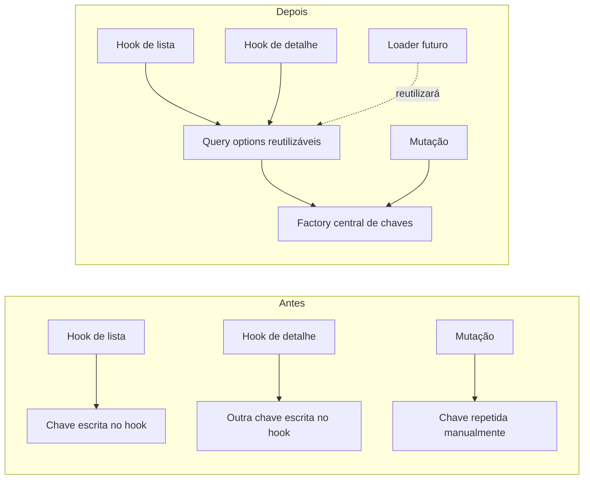
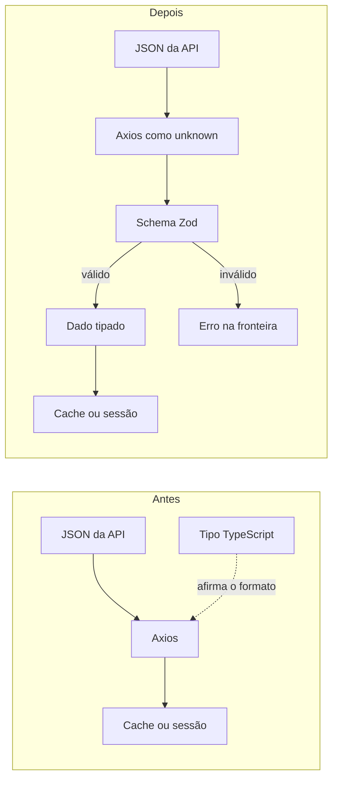
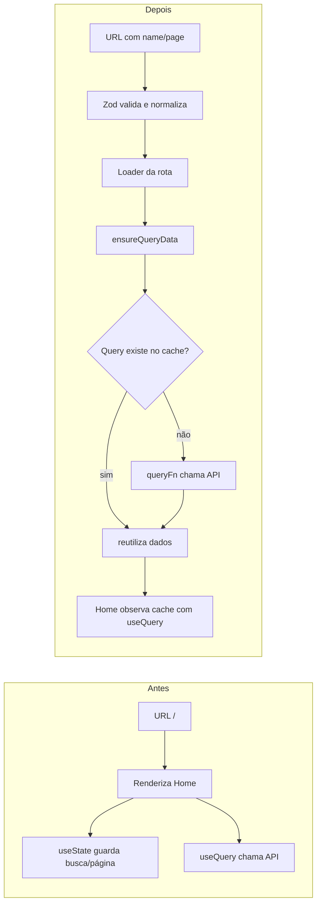

# Progresso de aprendizado

Este diário preserva o que foi aprendido e alterado em cada item do
[`learning_path.md`](../../learning_path.md). O processo obrigatório para
estudar e encerrar um item está em
[`plans/learning-path-workflow.md`](plans/learning-path-workflow.md).

## Fase 1, Item 1 — Server state versus client state

**Status:** concluído em 2026-07-22.

**Commit da implementação:** `2c28133` —
`refactor: centralize refund query keys/options and tune query client`, no
repositório `Refund-FrontEnd`.

### Por que estudar

Os reembolsos são *server state*: representam uma cópia local de dados que
pertencem à API e podem ficar desatualizados. TanStack Query precisa saber por
quanto tempo essa cópia é considerada fresca, como identificar cada consulta e
como cancelar uma requisição que deixou de ser necessária.

Sem políticas explícitas e uma fonte única para as chaves, cada hook podia
descrever o mesmo recurso de maneira diferente. Isso aumenta o risco de
invalidar apenas parte do cache, repetir requisições e duplicar a configuração
quando os loaders do React Router forem introduzidos.

### Estado anterior

Em `Refund-FrontEnd/src/hooks/useRefunds.ts`, a chave e a função de busca viviam
dentro do hook:

```ts
return useQuery({
  queryKey: ["refunds", { page, perPage, name }],
  queryFn: async () => {
    const { data } = await api.get<RefundsListResponse>("/refunds", {
      params: { page, per_page: perPage, name: name || undefined },
    });
    return data;
  },
});
```

As mutações repetiam uma chave escrita manualmente:

```ts
queryClient.invalidateQueries({ queryKey: ["refunds"] });
```

O `QueryClient` era criado sem políticas próprias em
`Refund-FrontEnd/src/main.tsx`:

```ts
const queryClient = new QueryClient();
```

### Comparação visual



### Estado ajustado

`Refund-FrontEnd/src/hooks/refundQueries.ts` passou a ser a fonte única das
chaves e opções de consulta:

```ts
export const refundKeys = {
  all: ["refunds"] as const,
  list: (params: RefundListParams) => [...refundKeys.all, "list", params] as const,
  detail: (id: string) => [...refundKeys.all, "detail", id] as const,
};

export function refundListQuery(params: RefundListParams) {
  return queryOptions({
    queryKey: refundKeys.list(params),
    queryFn: async ({ signal }) => {
      const { data } = await api.get<RefundsListResponse>("/refunds", {
        params: { page: params.page, per_page: params.perPage, name: params.name || undefined },
        signal,
      });
      return data;
    },
  });
}
```

`Refund-FrontEnd/src/lib/query-client.ts` tornou explícitas as políticas gerais:

```ts
export const queryClient = new QueryClient({
  defaultOptions: {
    queries: {
      staleTime: 30_000,
      retry: 1,
      refetchOnWindowFocus: false,
    },
  },
});
```

Os hooks agora consomem a configuração compartilhada, e as mutações invalidam
`refundKeys.all`. O `AbortSignal` fornecido pelo TanStack Query também é
encaminhado ao Axios.

### Arquivos modificados

- Criados `src/hooks/refundQueries.ts` e `src/lib/query-client.ts`.
- Ajustados `src/hooks/useRefunds.ts`, `src/hooks/useRefund.ts`,
  `src/hooks/useCreateRefund.ts`, `src/hooks/useDeleteRefund.ts` e
  `src/main.tsx`.

### Verificações e limitações

- `npx tsc -b --noEmit`: passou com código de saída 0 na sessão de conclusão.
- A validação em runtime contra a API real ficou pendente: ainda é necessário
  conferir lista, busca, paginação, criação, exclusão, detalhe e o comportamento
  de retorno à Home dentro dos 30 segundos de `staleTime`.
- O lint já possuía 18 erros `react-refresh/only-export-components` anteriores
  ao item e não fez parte dessa mudança.

### O que lembrar

- `useState` guarda estado pertencente à interface; TanStack Query administra
  cópias locais de dados pertencentes ao servidor.
- A `queryKey` é a identidade do dado no cache, não apenas um nome para o hook.
- `staleTime` define frescor; não significa que o dado é removido após 30
  segundos.
- Centralizar chaves e `queryOptions` evita divergência entre hooks, mutações e
  futuros loaders.

## Fase 1, Item 2 — Schemas como fronteira

**Status:** concluído em 2026-07-22.

**Commit da implementação:** `e6b8ea5` —
`feat: validate API responses with Zod schemas`, no repositório
`Refund-FrontEnd`.

### Por que estudar

TypeScript verifica o código durante o desenvolvimento, mas seus tipos não
existem quando a aplicação está executando. Um genérico como
`api.get<RefundsListResponse>()` apenas pede que o compilador confie naquele
formato; ele não inspeciona o JSON recebido.

Uma resposta incompatível podia entrar no cache do TanStack Query ou na sessão
antes de o problema aparecer na UI. O Zod transforma o contrato em código
executável: a aplicação só aceita o dado depois de validá-lo na fronteira HTTP.

### Estado anterior

Em `Refund-FrontEnd/src/hooks/refundQueries.ts`, a listagem confiava no genérico
do Axios e devolvia os dados diretamente:

```ts
const { data } = await api.get<RefundsListResponse>("/refunds", {
  params: { page: params.page, per_page: params.perPage, name: params.name || undefined },
  signal,
});
return data;
```

Em `Refund-FrontEnd/src/context/AuthContext.tsx`, `LoginResponse` era uma
interface manual usada da mesma maneira:

```ts
const { data } = await api.post<LoginResponse>("/auth/login", { email, password });
```

Havia ainda uma divergência escondida em
`Refund-FrontEnd/src/hooks/useCreateRefund.ts`: a chamada afirmava receber um
`Refund` completo, embora a criação da API não devolva `created_at`.

### Comparação visual



### Estado ajustado

`Refund-FrontEnd/src/schemas/refund.ts` passou a conter schemas executáveis e
tipos derivados da mesma fonte:

```ts
export const refundSchema = refundBaseSchema.extend({
  created_at: z.string().nullable(),
});

export const refundsListResponseSchema = z.object({
  type: z.literal("Refund"),
  count: z.number().int().nonnegative(),
  total: z.number().int().nonnegative(),
  page: z.number().int().positive(),
  per_page: z.number().int().min(1).max(100),
  total_pages: z.number().int().nonnegative(),
  attributes: z.array(refundSchema),
});

export type Refund = z.output<typeof refundSchema>;
```

A listagem agora trata a resposta como desconhecida até a validação:

```ts
const { data } = await api.get<unknown>("/refunds", {
  params: { page: params.page, per_page: params.perPage, name: params.name || undefined },
  signal,
});
return refundsListResponseSchema.parse(data);
```

O mesmo padrão foi aplicado ao login, detalhe e criação. A criação recebeu um
schema próprio baseado nos campos realmente devolvidos pela API, sem
`created_at`. O arquivo manual `src/types/refund.ts` deixou de ser necessário.

Neste item não houve coerção nas respostas, portanto `z.input` e `z.output`
seriam iguais. `z.output` foi usado para derivar os tipos validados; a diferença
entre entrada e saída continua demonstrada no formulário, onde
`z.coerce.number()` transforma o valor digitado.

### Arquivos modificados

- Criado `src/schemas/auth.ts`.
- Ampliado `src/schemas/refund.ts`.
- Ajustados `src/context/AuthContext.tsx`, `src/hooks/refundQueries.ts` e
  `src/hooks/useCreateRefund.ts`.
- Removido `src/types/refund.ts`.

### Verificações e limitações

- `npx tsc -b --noEmit`: passou com código de saída 0.
- `npm run build`: passou; o Vite manteve o aviso preexistente de chunk acima de
  500 kB, sem falhar o build.
- Auditoria com `rg`: login, listagem, detalhe e criação usam response
  `unknown` seguido de `schema.parse`.
- Não foi introduzido Vitest porque a infraestrutura de testes frontend é o
  Item 4. Os testes automatizados dos schemas serão acrescentados naquele item.
- A validação dos fluxos contra a API real ainda depende de subir frontend,
  backend e banco.
- O `JSON.parse(raw) as AuthUser` do `localStorage` continua sem validação. Essa
  fronteira não é uma resposta HTTP e ficou fora do escopo aprovado.

### O que lembrar

- Tipos TypeScript não validam dados externos em runtime.
- Dados externos devem ser tratados como `unknown` até atravessarem um schema.
- Derivar tipos com `z.output<typeof schema>` evita manter interface e schema
  manualmente em paralelo.
- Schemas devem representar o contrato real: criação e consulta podem devolver
  formas diferentes do mesmo recurso.
- `parse` devolve o dado validado ou lança `ZodError`; assim, dados inválidos não
  entram silenciosamente no cache ou na sessão.

## Fase 1, Item 3 — React Router Data APIs e estado na URL

**Status:** concluído em 2026-07-22.

**Commit da implementação:** `e62a862` (`feat: add data router loaders and URL
state`), no repositório `Refund-FrontEnd`.

### Por que estudar

A Home guardava busca e página somente em `useState`. A interface conhecia a
posição atual, mas a URL continuava `/`. Recarregar a aplicação perdia os
filtros, compartilhar o endereço não reproduzia a mesma tela e o router não
conseguia preparar a consulta antes de renderizar a página.

Loaders são funções do React Router executadas durante a navegação. Eles não
renderizam componentes nem substituem o TanStack Query: descrevem quais dados a
rota precisa antes de ficar pronta. O `QueryClient` continua responsável pelo
server state e `ensureQueryData` garante a query no cache, buscando na API apenas
quando aquela chave ainda não existe.

### Estado anterior

Em `Refund-FrontEnd/src/pages/PageHome.tsx`, busca e página eram memória local:

```ts
const [search, setSearch] = useState("");
const [page, setPage] = useState(1);
const debouncedSearch = useDebouncedValue(search);

const { data } = useRefunds({ page, name: debouncedSearch });
```

Em `Refund-FrontEnd/src/App.tsx`, `<BrowserRouter><Routes>` apenas renderizava os
componentes. Todas as páginas eram importadas no bundle inicial e não existiam
loaders ou erro de rota.

### Comparação visual



O `localStorage` e o cache têm funções diferentes:

```text
localStorage       -> token e usuário; permanece após reload
QueryClient cache  -> responses da API; vive em memória nesta configuração
```

Em um reload, a sessão permanece, mas um novo `QueryClient` começa vazio. O
loader verifica a sessão, `ensureQueryData` não encontra a chave e executa a
`queryFn`. Em uma navegação interna com a chave já armazenada, a consulta é
reutilizada.

### Estado ajustado

`Refund-FrontEnd/src/router-loaders.ts` conecta URL, sessão e cache:

```ts
export async function homeLoader({ request }: LoaderFunctionArgs) {
  requireSession();

  const url = new URL(request.url);
  const { page, name } = refundListSearchParamsSchema.parse({
    page: url.searchParams.get("page") ?? undefined,
    name: url.searchParams.get("name") ?? undefined,
  });
  const queryParams = { page, perPage: 6, name };

  await queryClient.ensureQueryData(refundListQuery(queryParams));
  return queryParams;
}
```

O código real também normaliza a URL: remove `page=1` e busca vazia, converte
página inválida para 1 e remove espaços externos do nome antes de consultar.

`Refund-FrontEnd/src/router.tsx` usa `createBrowserRouter`, mantém os layouts e
carrega as páginas com imports lazy. `App.tsx` passou a renderizar somente o
`AuthProvider` e o `RouterProvider`.

A Home consome os parâmetros validados:

```ts
const { page, perPage, name } = useLoaderData<typeof homeLoader>();
const [, setSearchParams] = useSearchParams();
const { data } = useRefunds({ page, perPage, name });
```

O campo mantém um rascunho local para responder imediatamente à digitação. Após
o debounce, ele atualiza a URL; paginação também altera search params. Uma `key`
baseada no nome recria somente o campo quando back/forward muda a busca, evitando
copiar estado da URL com `setState` dentro de um efeito.

### Arquivos modificados

- Criados `src/router.tsx`, `src/router-loaders.ts` e
  `src/pages/PageRouteError.tsx`.
- Ajustados `src/App.tsx`, `src/pages/PageHome.tsx` e
  `src/schemas/refund.ts`.

### Verificações e limitações

- `npx tsc -b --noEmit`: passou com código de saída 0.
- `npm run build`: passou e gerou chunks separados para Home, Login, Registro,
  Detalhe, Sucesso e Componentes.
- O bundle principal ainda ultrapassa 500 kB; o aviso de performance permanece
  fora deste item.
- `npm run lint`: continua falhando somente nos 18 erros preexistentes de
  `react-refresh/only-export-components`; o erro novo detectado durante a
  implementação foi corrigido antes do encerramento.
- Frontend `/` e `/?name=hotel&page=2` responderam HTTP 200; API `/health`
  respondeu HTTP 200.
- Não havia navegador conectado à sessão. Login, busca, paginação, reload,
  back/forward, detalhe e erros de loader ainda precisam de validação manual.
- Testes automatizados de schemas e router não foram introduzidos porque o
  setup de Vitest é o Item 4.

### O que lembrar

- Loader coordena a preparação da rota; `useQuery` mantém o componente reativo.
- `QueryClient` é a interface programática do mesmo cache acessado pelos hooks.
- `ensureQueryData` reutiliza a query existente ou executa sua `queryFn` quando
  a chave não existe.
- Query keys ficam no cache em memória, não no `localStorage`.
- URL é o lugar apropriado para estado de navegação compartilhável, como busca
  e página.
- `route.lazy` divide código por página; `ErrorBoundary` da rota recebe falhas
  que podem acontecer antes de o componente renderizar.
