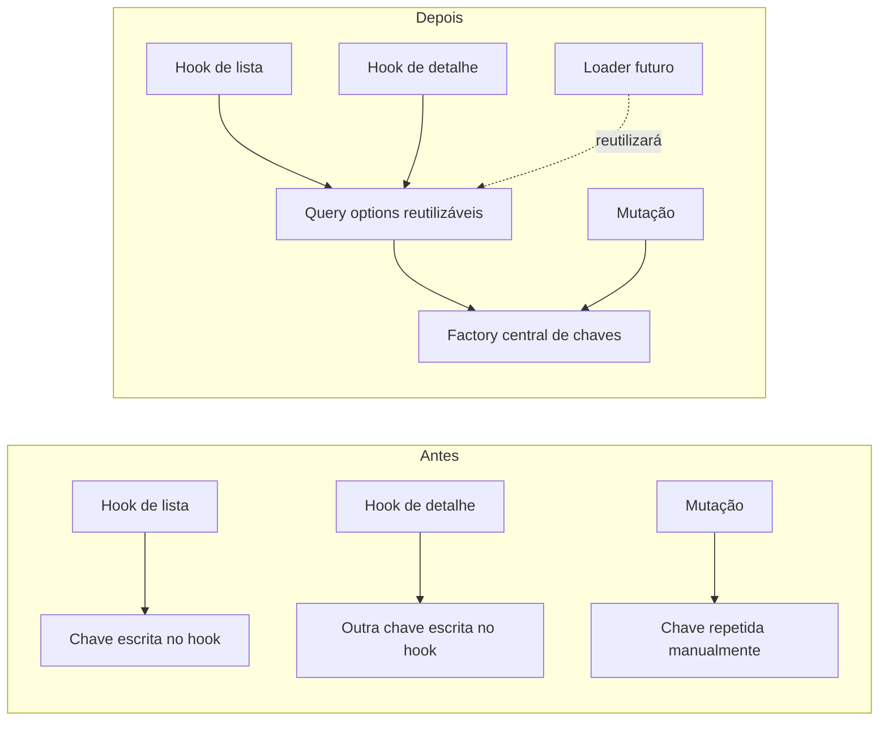

# Progresso de aprendizado

Este diário preserva o que foi aprendido e alterado em cada item do
[`learning_path.md`](../../learning_path.md). O processo obrigatório para
estudar e encerrar um item está em
[`plans/learning-path-workflow.md`](plans/learning-path-workflow.md).

## Fase 1, Item 1 — Server state versus client state

**Status:** concluído em 2026-07-22.

**Commit da implementação:** `2c28133` —
`refactor: centralize refund query keys/options and tune query client`, no
repositório `Refund-FrontEnd`.

### Por que estudar

Os reembolsos são *server state*: representam uma cópia local de dados que
pertencem à API e podem ficar desatualizados. TanStack Query precisa saber por
quanto tempo essa cópia é considerada fresca, como identificar cada consulta e
como cancelar uma requisição que deixou de ser necessária.

Sem políticas explícitas e uma fonte única para as chaves, cada hook podia
descrever o mesmo recurso de maneira diferente. Isso aumenta o risco de
invalidar apenas parte do cache, repetir requisições e duplicar a configuração
quando os loaders do React Router forem introduzidos.

### Estado anterior

Em `Refund-FrontEnd/src/hooks/useRefunds.ts`, a chave e a função de busca viviam
dentro do hook:

```ts
return useQuery({
  queryKey: ["refunds", { page, perPage, name }],
  queryFn: async () => {
    const { data } = await api.get<RefundsListResponse>("/refunds", {
      params: { page, per_page: perPage, name: name || undefined },
    });
    return data;
  },
});
```

As mutações repetiam uma chave escrita manualmente:

```ts
queryClient.invalidateQueries({ queryKey: ["refunds"] });
```

O `QueryClient` era criado sem políticas próprias em
`Refund-FrontEnd/src/main.tsx`:

```ts
const queryClient = new QueryClient();
```

### Comparação visual



### Estado ajustado

`Refund-FrontEnd/src/hooks/refundQueries.ts` passou a ser a fonte única das
chaves e opções de consulta:

```ts
export const refundKeys = {
  all: ["refunds"] as const,
  list: (params: RefundListParams) => [...refundKeys.all, "list", params] as const,
  detail: (id: string) => [...refundKeys.all, "detail", id] as const,
};

export function refundListQuery(params: RefundListParams) {
  return queryOptions({
    queryKey: refundKeys.list(params),
    queryFn: async ({ signal }) => {
      const { data } = await api.get<RefundsListResponse>("/refunds", {
        params: { page: params.page, per_page: params.perPage, name: params.name || undefined },
        signal,
      });
      return data;
    },
  });
}
```

`Refund-FrontEnd/src/lib/query-client.ts` tornou explícitas as políticas gerais:

```ts
export const queryClient = new QueryClient({
  defaultOptions: {
    queries: {
      staleTime: 30_000,
      retry: 1,
      refetchOnWindowFocus: false,
    },
  },
});
```

Os hooks agora consomem a configuração compartilhada, e as mutações invalidam
`refundKeys.all`. O `AbortSignal` fornecido pelo TanStack Query também é
encaminhado ao Axios.

### Arquivos modificados

- Criados `src/hooks/refundQueries.ts` e `src/lib/query-client.ts`.
- Ajustados `src/hooks/useRefunds.ts`, `src/hooks/useRefund.ts`,
  `src/hooks/useCreateRefund.ts`, `src/hooks/useDeleteRefund.ts` e
  `src/main.tsx`.

### Verificações e limitações

- `npx tsc -b --noEmit`: passou com código de saída 0 na sessão de conclusão.
- A validação em runtime contra a API real ficou pendente: ainda é necessário
  conferir lista, busca, paginação, criação, exclusão, detalhe e o comportamento
  de retorno à Home dentro dos 30 segundos de `staleTime`.
- O lint já possuía 18 erros `react-refresh/only-export-components` anteriores
  ao item e não fez parte dessa mudança.

### O que lembrar

- `useState` guarda estado pertencente à interface; TanStack Query administra
  cópias locais de dados pertencentes ao servidor.
- A `queryKey` é a identidade do dado no cache, não apenas um nome para o hook.
- `staleTime` define frescor; não significa que o dado é removido após 30
  segundos.
- Centralizar chaves e `queryOptions` evita divergência entre hooks, mutações e
  futuros loaders.

## Fase 1, Item 2 — Schemas como fronteira

**Status:** próximo item; ainda não implementado.

O frontend atualmente usa genéricos TypeScript nas chamadas Axios para login,
listagem, detalhe e criação. Esses tipos ajudam durante o desenvolvimento, mas
não validam os dados reais recebidos em runtime. O estudo continuará mostrando
esses pontos antes de definir e aprovar a solução com Zod.
