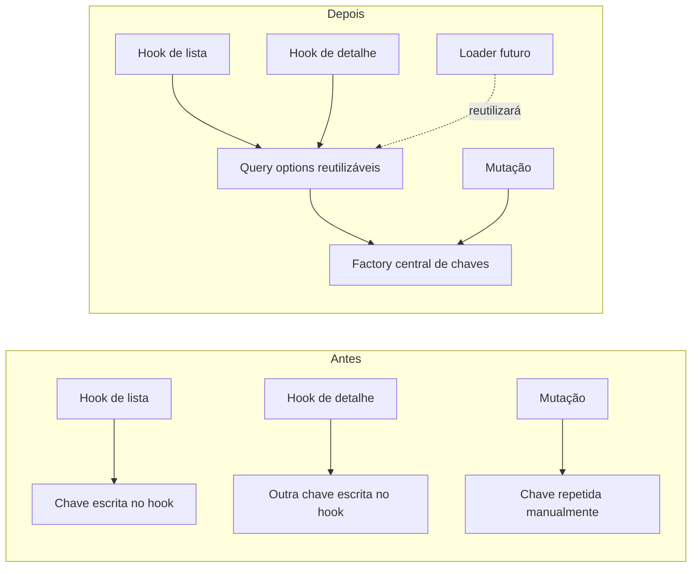
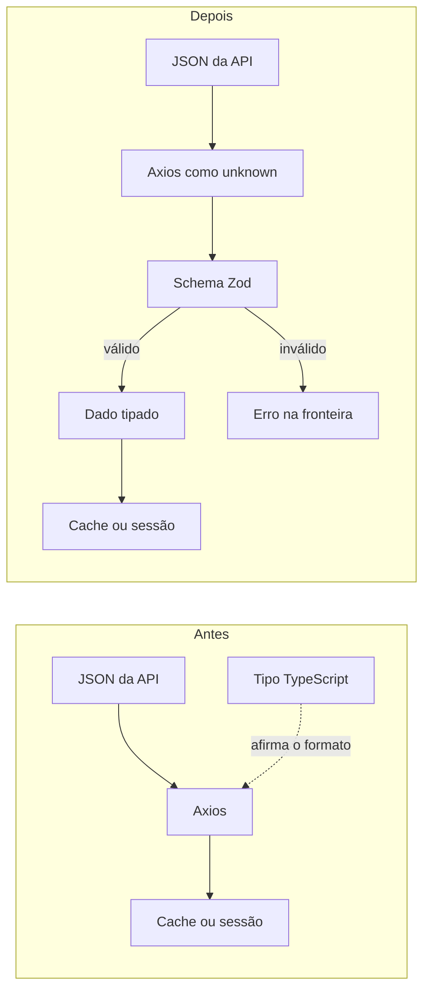
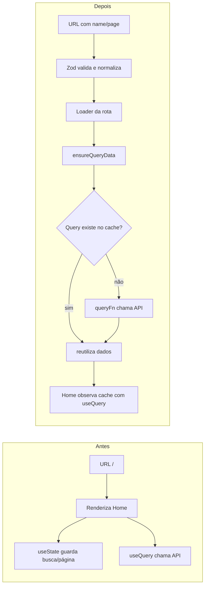
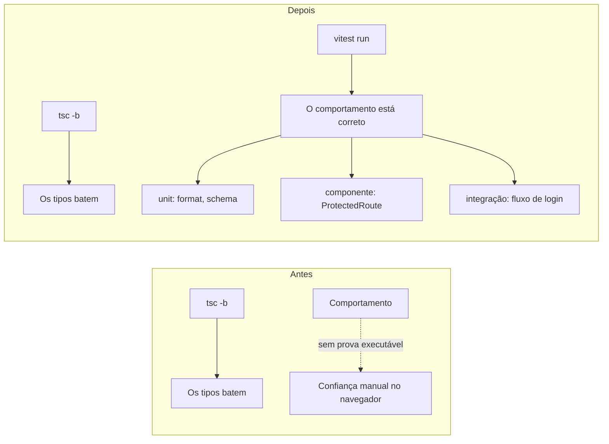
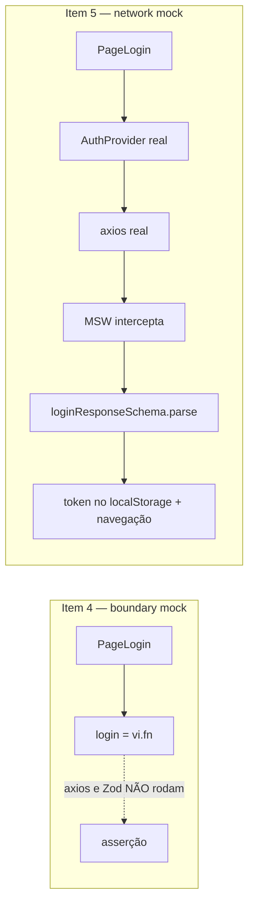
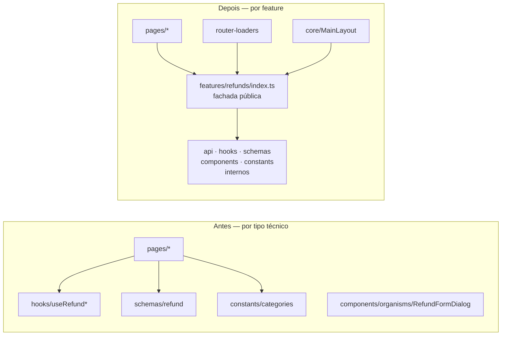

# Progresso de aprendizado

Este diário preserva o que foi aprendido e alterado em cada item do
[`learning_path.md`](../../learning_path.md). O processo obrigatório para
estudar e encerrar um item está em
[`plans/learning-path-workflow.md`](plans/learning-path-workflow.md).

## Fase 1, Item 1 — Server state versus client state

**Status:** concluído em 2026-07-22.

**Commit da implementação:** `2c28133` —
`refactor: centralize refund query keys/options and tune query client`, no
repositório `Refund-FrontEnd`.

### Por que estudar

Os reembolsos são *server state*: representam uma cópia local de dados que
pertencem à API e podem ficar desatualizados. TanStack Query precisa saber por
quanto tempo essa cópia é considerada fresca, como identificar cada consulta e
como cancelar uma requisição que deixou de ser necessária.

Sem políticas explícitas e uma fonte única para as chaves, cada hook podia
descrever o mesmo recurso de maneira diferente. Isso aumenta o risco de
invalidar apenas parte do cache, repetir requisições e duplicar a configuração
quando os loaders do React Router forem introduzidos.

### Estado anterior

Em `Refund-FrontEnd/src/hooks/useRefunds.ts`, a chave e a função de busca viviam
dentro do hook:

```ts
return useQuery({
  queryKey: ["refunds", { page, perPage, name }],
  queryFn: async () => {
    const { data } = await api.get<RefundsListResponse>("/refunds", {
      params: { page, per_page: perPage, name: name || undefined },
    });
    return data;
  },
});
```

As mutações repetiam uma chave escrita manualmente:

```ts
queryClient.invalidateQueries({ queryKey: ["refunds"] });
```

O `QueryClient` era criado sem políticas próprias em
`Refund-FrontEnd/src/main.tsx`:

```ts
const queryClient = new QueryClient();
```

### Comparação visual



### Estado ajustado

`Refund-FrontEnd/src/hooks/refundQueries.ts` passou a ser a fonte única das
chaves e opções de consulta:

```ts
export const refundKeys = {
  all: ["refunds"] as const,
  list: (params: RefundListParams) => [...refundKeys.all, "list", params] as const,
  detail: (id: string) => [...refundKeys.all, "detail", id] as const,
};

export function refundListQuery(params: RefundListParams) {
  return queryOptions({
    queryKey: refundKeys.list(params),
    queryFn: async ({ signal }) => {
      const { data } = await api.get<RefundsListResponse>("/refunds", {
        params: { page: params.page, per_page: params.perPage, name: params.name || undefined },
        signal,
      });
      return data;
    },
  });
}
```

`Refund-FrontEnd/src/lib/query-client.ts` tornou explícitas as políticas gerais:

```ts
export const queryClient = new QueryClient({
  defaultOptions: {
    queries: {
      staleTime: 30_000,
      retry: 1,
      refetchOnWindowFocus: false,
    },
  },
});
```

Os hooks agora consomem a configuração compartilhada, e as mutações invalidam
`refundKeys.all`. O `AbortSignal` fornecido pelo TanStack Query também é
encaminhado ao Axios.

### Arquivos modificados

- Criados `src/hooks/refundQueries.ts` e `src/lib/query-client.ts`.
- Ajustados `src/hooks/useRefunds.ts`, `src/hooks/useRefund.ts`,
  `src/hooks/useCreateRefund.ts`, `src/hooks/useDeleteRefund.ts` e
  `src/main.tsx`.

### Verificações e limitações

- `npx tsc -b --noEmit`: passou com código de saída 0 na sessão de conclusão.
- A validação em runtime contra a API real ficou pendente: ainda é necessário
  conferir lista, busca, paginação, criação, exclusão, detalhe e o comportamento
  de retorno à Home dentro dos 30 segundos de `staleTime`.
- O lint já possuía 18 erros `react-refresh/only-export-components` anteriores
  ao item e não fez parte dessa mudança.

### O que lembrar

- `useState` guarda estado pertencente à interface; TanStack Query administra
  cópias locais de dados pertencentes ao servidor.
- A `queryKey` é a identidade do dado no cache, não apenas um nome para o hook.
- `staleTime` define frescor; não significa que o dado é removido após 30
  segundos.
- Centralizar chaves e `queryOptions` evita divergência entre hooks, mutações e
  futuros loaders.

## Fase 1, Item 2 — Schemas como fronteira

**Status:** concluído em 2026-07-22.

**Commit da implementação:** `e6b8ea5` —
`feat: validate API responses with Zod schemas`, no repositório
`Refund-FrontEnd`.

### Por que estudar

TypeScript verifica o código durante o desenvolvimento, mas seus tipos não
existem quando a aplicação está executando. Um genérico como
`api.get<RefundsListResponse>()` apenas pede que o compilador confie naquele
formato; ele não inspeciona o JSON recebido.

Uma resposta incompatível podia entrar no cache do TanStack Query ou na sessão
antes de o problema aparecer na UI. O Zod transforma o contrato em código
executável: a aplicação só aceita o dado depois de validá-lo na fronteira HTTP.

### Estado anterior

Em `Refund-FrontEnd/src/hooks/refundQueries.ts`, a listagem confiava no genérico
do Axios e devolvia os dados diretamente:

```ts
const { data } = await api.get<RefundsListResponse>("/refunds", {
  params: { page: params.page, per_page: params.perPage, name: params.name || undefined },
  signal,
});
return data;
```

Em `Refund-FrontEnd/src/context/AuthContext.tsx`, `LoginResponse` era uma
interface manual usada da mesma maneira:

```ts
const { data } = await api.post<LoginResponse>("/auth/login", { email, password });
```

Havia ainda uma divergência escondida em
`Refund-FrontEnd/src/hooks/useCreateRefund.ts`: a chamada afirmava receber um
`Refund` completo, embora a criação da API não devolva `created_at`.

### Comparação visual



### Estado ajustado

`Refund-FrontEnd/src/schemas/refund.ts` passou a conter schemas executáveis e
tipos derivados da mesma fonte:

```ts
export const refundSchema = refundBaseSchema.extend({
  created_at: z.string().nullable(),
});

export const refundsListResponseSchema = z.object({
  type: z.literal("Refund"),
  count: z.number().int().nonnegative(),
  total: z.number().int().nonnegative(),
  page: z.number().int().positive(),
  per_page: z.number().int().min(1).max(100),
  total_pages: z.number().int().nonnegative(),
  attributes: z.array(refundSchema),
});

export type Refund = z.output<typeof refundSchema>;
```

A listagem agora trata a resposta como desconhecida até a validação:

```ts
const { data } = await api.get<unknown>("/refunds", {
  params: { page: params.page, per_page: params.perPage, name: params.name || undefined },
  signal,
});
return refundsListResponseSchema.parse(data);
```

O mesmo padrão foi aplicado ao login, detalhe e criação. A criação recebeu um
schema próprio baseado nos campos realmente devolvidos pela API, sem
`created_at`. O arquivo manual `src/types/refund.ts` deixou de ser necessário.

Neste item não houve coerção nas respostas, portanto `z.input` e `z.output`
seriam iguais. `z.output` foi usado para derivar os tipos validados; a diferença
entre entrada e saída continua demonstrada no formulário, onde
`z.coerce.number()` transforma o valor digitado.

### Arquivos modificados

- Criado `src/schemas/auth.ts`.
- Ampliado `src/schemas/refund.ts`.
- Ajustados `src/context/AuthContext.tsx`, `src/hooks/refundQueries.ts` e
  `src/hooks/useCreateRefund.ts`.
- Removido `src/types/refund.ts`.

### Verificações e limitações

- `npx tsc -b --noEmit`: passou com código de saída 0.
- `npm run build`: passou; o Vite manteve o aviso preexistente de chunk acima de
  500 kB, sem falhar o build.
- Auditoria com `rg`: login, listagem, detalhe e criação usam response
  `unknown` seguido de `schema.parse`.
- Não foi introduzido Vitest porque a infraestrutura de testes frontend é o
  Item 4. Os testes automatizados dos schemas serão acrescentados naquele item.
- A validação dos fluxos contra a API real ainda depende de subir frontend,
  backend e banco.
- O `JSON.parse(raw) as AuthUser` do `localStorage` continua sem validação. Essa
  fronteira não é uma resposta HTTP e ficou fora do escopo aprovado.

### O que lembrar

- Tipos TypeScript não validam dados externos em runtime.
- Dados externos devem ser tratados como `unknown` até atravessarem um schema.
- Derivar tipos com `z.output<typeof schema>` evita manter interface e schema
  manualmente em paralelo.
- Schemas devem representar o contrato real: criação e consulta podem devolver
  formas diferentes do mesmo recurso.
- `parse` devolve o dado validado ou lança `ZodError`; assim, dados inválidos não
  entram silenciosamente no cache ou na sessão.

## Fase 1, Item 3 — React Router Data APIs e estado na URL

**Status:** concluído em 2026-07-22.

**Commit da implementação:** `e62a862` (`feat: add data router loaders and URL
state`), no repositório `Refund-FrontEnd`.

### Por que estudar

A Home guardava busca e página somente em `useState`. A interface conhecia a
posição atual, mas a URL continuava `/`. Recarregar a aplicação perdia os
filtros, compartilhar o endereço não reproduzia a mesma tela e o router não
conseguia preparar a consulta antes de renderizar a página.

Loaders são funções do React Router executadas durante a navegação. Eles não
renderizam componentes nem substituem o TanStack Query: descrevem quais dados a
rota precisa antes de ficar pronta. O `QueryClient` continua responsável pelo
server state e `ensureQueryData` garante a query no cache, buscando na API apenas
quando aquela chave ainda não existe.

### Estado anterior

Em `Refund-FrontEnd/src/pages/PageHome.tsx`, busca e página eram memória local:

```ts
const [search, setSearch] = useState("");
const [page, setPage] = useState(1);
const debouncedSearch = useDebouncedValue(search);

const { data } = useRefunds({ page, name: debouncedSearch });
```

Em `Refund-FrontEnd/src/App.tsx`, `<BrowserRouter><Routes>` apenas renderizava os
componentes. Todas as páginas eram importadas no bundle inicial e não existiam
loaders ou erro de rota.

### Comparação visual



O `localStorage` e o cache têm funções diferentes:

```text
localStorage       -> token e usuário; permanece após reload
QueryClient cache  -> responses da API; vive em memória nesta configuração
```

Em um reload, a sessão permanece, mas um novo `QueryClient` começa vazio. O
loader verifica a sessão, `ensureQueryData` não encontra a chave e executa a
`queryFn`. Em uma navegação interna com a chave já armazenada, a consulta é
reutilizada.

### Estado ajustado

`Refund-FrontEnd/src/router-loaders.ts` conecta URL, sessão e cache:

```ts
export async function homeLoader({ request }: LoaderFunctionArgs) {
  requireSession();

  const url = new URL(request.url);
  const { page, name } = refundListSearchParamsSchema.parse({
    page: url.searchParams.get("page") ?? undefined,
    name: url.searchParams.get("name") ?? undefined,
  });
  const queryParams = { page, perPage: 6, name };

  await queryClient.ensureQueryData(refundListQuery(queryParams));
  return queryParams;
}
```

O código real também normaliza a URL: remove `page=1` e busca vazia, converte
página inválida para 1 e remove espaços externos do nome antes de consultar.

`Refund-FrontEnd/src/router.tsx` usa `createBrowserRouter`, mantém os layouts e
carrega as páginas com imports lazy. `App.tsx` passou a renderizar somente o
`AuthProvider` e o `RouterProvider`.

A Home consome os parâmetros validados:

```ts
const { page, perPage, name } = useLoaderData<typeof homeLoader>();
const [, setSearchParams] = useSearchParams();
const { data } = useRefunds({ page, perPage, name });
```

O campo mantém um rascunho local para responder imediatamente à digitação. Após
o debounce, ele atualiza a URL; paginação também altera search params. Uma `key`
baseada no nome recria somente o campo quando back/forward muda a busca, evitando
copiar estado da URL com `setState` dentro de um efeito.

### Arquivos modificados

- Criados `src/router.tsx`, `src/router-loaders.ts` e
  `src/pages/PageRouteError.tsx`.
- Ajustados `src/App.tsx`, `src/pages/PageHome.tsx` e
  `src/schemas/refund.ts`.

### Verificações e limitações

- `npx tsc -b --noEmit`: passou com código de saída 0.
- `npm run build`: passou e gerou chunks separados para Home, Login, Registro,
  Detalhe, Sucesso e Componentes.
- O bundle principal ainda ultrapassa 500 kB; o aviso de performance permanece
  fora deste item.
- `npm run lint`: continua falhando somente nos 18 erros preexistentes de
  `react-refresh/only-export-components`; o erro novo detectado durante a
  implementação foi corrigido antes do encerramento.
- Frontend `/` e `/?name=hotel&page=2` responderam HTTP 200; API `/health`
  respondeu HTTP 200.
- Não havia navegador conectado à sessão. Login, busca, paginação, reload,
  back/forward, detalhe e erros de loader ainda precisam de validação manual.
- Testes automatizados de schemas e router não foram introduzidos porque o
  setup de Vitest é o Item 4.

### O que lembrar

- Loader coordena a preparação da rota; `useQuery` mantém o componente reativo.
- `QueryClient` é a interface programática do mesmo cache acessado pelos hooks.
- `ensureQueryData` reutiliza a query existente ou executa sua `queryFn` quando
  a chave não existe.
- Query keys ficam no cache em memória, não no `localStorage`.
- URL é o lugar apropriado para estado de navegação compartilhável, como busca
  e página.
- `route.lazy` divide código por página; `ErrorBoundary` da rota recebe falhas
  que podem acontecer antes de o componente renderizar.

## Fase 2, Item 4 — Vitest, Testing Library e user-event

**Status:** concluído em 2026-07-24.

**Commit da implementação:** `55f8455` —
`test: set up Vitest + Testing Library and cover format, schema, guard and login`,
no repositório `Refund-FrontEnd`.

### Por que estudar

Os itens 1–3 estavam corretos por tipo (`tsc`), mas nenhum comportamento era
executado por um teste automatizado — as três pendências de runtime existiam
justamente porque não havia infraestrutura de teste no frontend. O `tsc` prova
formato em tempo de compilação; ele não roda `formatCentsToBRL`, não passa uma
entrada inválida pelo `refundCreateSchema` nem confirma que `ProtectedRoute`
redireciona quem não está logado.

Este item introduz a primeira base de testes do frontend (Vitest + jsdom +
Testing Library + user-event) e cobre quatro alvos por nível. É a fundação de que
o MSW (Item 5) e a pirâmide de testes (Item 6) dependem.

### Estado anterior

`package.json` só tinha `dev`, `build`, `lint`, `preview`; nenhuma dependência de
teste e nenhum arquivo `*.test.ts(x)`:

```json
"scripts": { "dev": "vite", "build": "tsc -b && vite build", "lint": "eslint .", "preview": "vite preview" }
```

### Comparação visual



| Alvo                 | Nível      | O que passou a ser provado                              |
|----------------------|------------|---------------------------------------------------------|
| `formatCentsToBRL`   | unitário   | centavos → BRL; zero, milhar e um único centavo         |
| `refundCreateSchema` | unitário   | recusa nome vazio, categoria inválida, valor ≤ 0 e NaN  |
| `ProtectedRoute`     | componente | logado vê o `Outlet`; deslogado vai para `/login`       |
| Fluxo de login       | integração | digitar + submeter chama `login` e navega; erro mostra msg |

### Estado ajustado

`vite.config.ts` passou a usar o `defineConfig` do Vitest e a declarar o ambiente
de teste:

```ts
import { defineConfig } from 'vitest/config'
// ...
  test: {
    environment: 'jsdom',
    setupFiles: './src/test/setup.ts',
  },
```

`src/test/setup.ts` registra os matchers do jest-dom e o `cleanup` entre testes
(necessário porque rodamos com imports explícitos, sem `globals: true`):

```ts
import "@testing-library/jest-dom/vitest";
import { afterEach } from "vitest";
import { cleanup } from "@testing-library/react";

afterEach(() => {
  cleanup();
});
```

O schema é testado campo a campo via `.shape`, evitando construir um `FileList`
no jsdom:

```ts
const result = refundCreateSchema.shape.amount.safeParse("-5");
expect(result.success).toBe(false);
if (!result.success) {
  expect(result.error.issues[0].message).toBe("Valor deve ser maior que zero");
}
```

O fluxo de login roda sem rede: um `AuthContext.Provider` de teste expõe um
`login` espião, e `user-event` dirige a interação.

```ts
const login = vi.fn().mockResolvedValue(undefined);
// render PageLogin dentro de MemoryRouter (/login + / marcada) + AuthContext
await user.type(screen.getByPlaceholderText("voce@exemplo.com"), "ana@exemplo.com");
await user.click(screen.getByRole("button", { name: "Entrar" }));
expect(login).toHaveBeenCalledWith("ana@exemplo.com", "secret123");
expect(await screen.findByText("home page")).toBeInTheDocument();
```

### Arquivos modificados

- Modificados: `package.json` (devDeps + scripts `test`/`test:watch`) e
  `vite.config.ts` (bloco `test`).
- Criados: `src/test/setup.ts`, `src/lib/format.test.ts`,
  `src/schemas/refund.test.ts`, `src/components/core/ProtectedRoute.test.tsx` e
  `src/pages/PageLogin.test.tsx`.
- devDependencies adicionadas: `vitest`, `jsdom`, `@testing-library/react`,
  `@testing-library/dom`, `@testing-library/user-event`,
  `@testing-library/jest-dom`.

### Verificações e limitações

- `npm run test`: 15 testes em 4 arquivos, todos verdes.
- `npx tsc -b --noEmit`: exit 0 (inclui os `*.test.tsx` sob `src`).
- `npm run lint`: 18 erros preexistentes de `react-refresh/only-export-components`,
  **zero** novos. Durante a implementação eu havia introduzido um erro
  (`triple-slash-reference` no `vite.config.ts`); foi detectado pelo lint e
  corrigido antes do encerramento.
- **Campo `file` do schema não testado aqui:** exige um `FileList`, que o jsdom
  não constrói de forma limpa. Fica coberto pelo teste de upload do
  `RefundFormDialog` (item futuro, com `user-event`).
- **Labels não associadas ao input:** o teste de login seleciona os campos por
  placeholder porque o `InputText` não liga `<label>`/`htmlFor` ao `<input>`.
  Essa dívida de acessibilidade é o Item 7.
- Os fluxos contra a API real continuam pendentes de validação manual; este item
  cobre comportamento isolado, não integração ponta a ponta.

### O que lembrar

- `tsc` prova formato; teste prova comportamento. São garantias diferentes.
- `setupFiles` roda uma vez por arquivo de teste — bom lugar para registrar
  matchers e `cleanup`.
- Sem `globals: true`, o Testing Library não limpa o DOM sozinho: registrar
  `afterEach(cleanup)` evita que o DOM de um teste vaze para o próximo.
- `schema.shape.<campo>` permite testar uma regra isolada sem montar o objeto
  inteiro (aqui, sem `FileList`).
- Mockar a **fronteira** (`login` no contexto) em vez da rede mantém o teste
  focado no comportamento da página; a rede fica para o MSW (Item 5).
- Prioridade de queries: prefira `getByRole`/`getByLabelText`; cair para
  `getByPlaceholderText` é aceitável, mas costuma sinalizar uma dívida de
  acessibilidade.

## Fase 2, Item 5 — MSW (Mock Service Worker)

**Status:** concluído em 2026-07-25.

**Commit da implementação:** `7bf7042` —
`test: add MSW network mocking and Vitest UI`, no repositório `Refund-FrontEnd`.

**Escopo:** MSW apenas para testes (node server). O worker de browser para
desenvolvimento (`msw/browser`) foi deliberadamente adiado. Também foi integrado
o Vitest UI (`@vitest/ui`) por pedido do Gabriel.

### Por que estudar

O teste de login do Item 4 mockou a fronteira do `AuthContext` (`login` como
`vi.fn()`), então o `axios` e os schemas de *response* nunca rodavam. Os schemas
do Item 2 (`refundsListResponseSchema`, `refundDetailResponseSchema`,
`refundCreateResponseSchema`) seguiam sem prova executável.

O MSW intercepta HTTP no nível da rede: o `axios` real roda, o `schema.parse`
real roda, e só a *resposta* é falsa. Isso fecha a dívida do Item 2 e cria a base
para os testes de integração da pirâmide (Item 6).

### Estado anterior

`src/test/setup.ts` só registrava jest-dom e `cleanup`; nenhum caminho de rede
(`refundQueries`, `useCreateRefund`, `AuthContext`) tinha teste. O `axios` usa
`baseURL: import.meta.env.VITE_API_URL` (`http://localhost:3333`, carregado do
`.env` também nos testes).

### Comparação visual



| Handler                | Testa                                                    |
|------------------------|---------------------------------------------------------|
| `POST */auth/login`    | login real + `loginResponseSchema` + token persistido   |
| `GET */refunds`        | `useRefunds` + `refundsListResponseSchema`              |
| `GET */refunds/:id`    | `useRefund` + `refundDetailResponseSchema`              |
| `POST */refunds`       | `useCreateRefund` + `refundCreateResponseSchema`        |
| `server.use(401/422)`  | `getApiErrorMessage` nos dois formatos de erro          |

### Estado ajustado

Handlers *happy-path* reutilizáveis, com caminhos `*` para casar qualquer host:

```ts
export const handlers = [
  http.post("*/auth/login", () => HttpResponse.json(loginFixture)),
  http.get("*/refunds", () => HttpResponse.json({ /* lista */ })),
  http.get("*/refunds/:id", ({ params }) => HttpResponse.json({ /* detalhe */ })),
  http.post("*/refunds", () => HttpResponse.json({ /* base */ }, { status: 201 })),
  http.delete("*/refunds/:id", () => new HttpResponse(null, { status: 204 })),
];
```

O ciclo de vida do servidor vive no setup, junto do `cleanup` e da limpeza de
`localStorage` (o `AuthProvider` real persiste token/sessão):

```ts
beforeAll(() => server.listen({ onUnhandledRequest: "error" }));
afterEach(() => { cleanup(); server.resetHandlers(); localStorage.clear(); });
afterAll(() => server.close());
```

Os testes de integração exercitam o caminho real. Response malformado é rejeitado
na fronteira (fecha a promessa do Item 2):

```ts
server.use(http.get("*/refunds", () =>
  HttpResponse.json({ type: "Refund", attributes: "nope" })));
// useRefunds via renderHook -> result.current.isError === true (ZodError)
```

E o override por teste cobre o 422 do FastAPI:

```ts
server.use(http.post("*/refunds", () =>
  HttpResponse.json({ detail: [{ msg: "Arquivo é obrigatório" }] }, { status: 422 })));
// getApiErrorMessage(result.current.error) === "Arquivo é obrigatório"
```

### Arquivos modificados

- Modificados: `package.json` (devDeps `msw`, `@vitest/ui`; script `test:ui`),
  `src/test/setup.ts` (ciclo do servidor MSW + `localStorage.clear`).
- Criados: `src/test/msw/handlers.ts`, `src/test/msw/server.ts`,
  `src/test/utils.tsx` (`QueryWrapper`), `src/hooks/refundQueries.test.tsx`,
  `src/pages/PageLogin.integration.test.tsx`, `src/hooks/useCreateRefund.test.tsx`.

### Verificações e limitações

- `npm run test`: 23 testes em 7 arquivos, todos verdes.
- `npx tsc -b --noEmit`: exit 0.
- `npm run lint`: 18 erros preexistentes, **zero** novos. Durante a implementação
  o `src/test/utils.tsx` chegou a exportar uma função + um componente (1 erro
  novo de `react-refresh`); foi resolvido deixando o arquivo com export único de
  componente, antes do encerramento.
- **Sanidade técnica confirmada:** MSW intercepta o `axios` dentro do jsdom
  (era o risco que eu havia sinalizado no plano).
- **Aviso do jsdom `Not implemented: navigation`:** aparece no teste de 401 do
  login porque o interceptor de `api.ts` faz `window.location.href = "/login"`
  em qualquer 401. Não é falha (o `MemoryRouter` ignora `window.location`); expôs
  um comportamento real do interceptor, candidato a refino futuro.
- **`FileList` continua sem construção real:** o teste de criação passa um
  `[File]` com cast, pois o `mutationFn` só lê `file[0]`.

### O que lembrar

- MSW mocka a **rede**, não a fronteira do código: axios e Zod reais rodam, só a
  resposta é falsa — mais confiança que mockar a função.
- `setupServer` + `listen`/`resetHandlers`/`close` é o ciclo padrão nos testes;
  `onUnhandledRequest: "error"` impede bater na API real por engano.
- `server.use(...)` sobrescreve um handler só para aquele teste; `resetHandlers`
  no `afterEach` desfaz.
- Testar via `renderHook` prova hook + `queryFn` + schema + rede juntos; um
  response malformado precisa virar `isError`, não entrar no cache.
- Um mesmo comportamento pode (e deve) ter testes em níveis diferentes:
  componente (rápido, isolado) e integração (mais caro, mais confiança) —
  antecipa a pirâmide do Item 6.

## Correções de runtime — exclusão de reembolso (2026-07-25)

Ao validar o app no navegador (backend + banco reais), a exclusão de um reembolso
a partir da página de detalhe **não** atualizava a lista da Home, e o log da API
mostrava `GET/DELETE /refunds/{id}` retornando **500** com vazamento de conexão.
A investigação revelou **dois bugs distintos** — um em cada repositório. Não são
itens novos do Learning Path; são correções, mas o aprendizado ficou registrado
aqui por ligar direto aos conceitos dos Itens 1, 3 e (no backend) 20/25.

### Bug 1 — `invalidateQueries` não refaz queries inativas (frontend)

**Commit:** `228ec8d` —
`fix: refresh refund lists after create/delete without refetching detail`, no
repositório `Refund-FrontEnd`.

**Sintoma:** o item excluído continuava na lista após voltar para a Home.

**Causa raiz:** três decisões se combinaram. A exclusão parte do **detalhe**, com
a Home desmontada → a query da lista está **inativa**. `invalidateQueries`, por
padrão (`refetchType: "active"`), **só refaz queries ativas**; a lista inativa era
só marcada como velha. Ao remontar, o `refetchOnMount` decide o refetch **pelo
tempo** (`staleTime` de 30s) e não pela flag de invalidação — como o dado tinha
menos de 30s, era considerado "fresco" e não era refeito. Resultado: item
fantasma por até 30s.

Havia ainda um **segundo efeito**: invalidar o prefixo `["refunds"]` inteiro
também refazia a query de **detalhe do item recém-deletado** (`GET /refunds/{id}`),
que no backend real virava erro — e essa rajada concorrente disparava o Bug 2.

**Comparação visual:**

```text
Antes  invalidateQueries({ queryKey: ["refunds"] })
       -> refaz só ATIVAS  -> lista inativa fica velha (some por até 30s)
       -> atinge o detalhe -> GET /refunds/{id} de item deletado -> erro

Depois invalidateQueries({ queryKey: ["refunds","list"], refetchType: "all" })
       -> refaz TODAS as listas (mesmo inativas), ignorando staleTime
       -> NÃO toca no detalhe -> nenhum GET do item deletado
```

**Estado ajustado:** nova chave `refundKeys.lists()` (prefixo só das listas) e, em
`useDeleteRefund`/`useCreateRefund`:

```ts
queryClient.invalidateQueries({ queryKey: refundKeys.lists(), refetchType: "all" });
```

**Teste:** `src/hooks/useDeleteRefund.test.tsx` — prova que, após excluir com a
lista inativa, o cache da lista vira `["A"]` **e** que o detalhe do item deletado
**não** é rebuscado (`detailCalls` permanece 1).

**O que lembrar:**
- `invalidateQueries` só refaz **queries ativas** por padrão; uma query invalidada
  enquanto inativa depende do `staleTime` na próxima montagem (`refetchOnMount`
  olha o tempo, não a flag). Use `refetchType: "all"` para forçar as inativas.
- Escopo importa: mire só o que precisa (`lists()`), nunca invalide o detalhe de
  algo que acabou de ser apagado.

### Bug 2 — sessão compartilhada no handler de conexão (backend)

**Commit:** `1fc0db0` —
`fix: make the database connection handler concurrency-safe`, no repositório
`Refund-api`.

**Sintoma:** `GET/DELETE /refunds/{id}` retornando 500 e o aviso do garbage
collector sobre conexão asyncpg não devolvida ao pool.

**Causa raiz:** `DatabaseConnectionHandler` era um **singleton de módulo** que
guardava a sessão em `self.session`:

```python
async def __aenter__(self):
    self.session = async_session()   # estado COMPARTILHADO entre requisições
    return self
```

Sob requisições **concorrentes** (que o Bug 1 provocava), a segunda sobrescrevia
o `self.session` da primeira: as duas usavam a mesma sessão asyncpg ao mesmo
tempo (erro de operação concorrente → 500) e a sessão órfã nunca fechava
(vazamento).

**Estado ajustado:** a sessão passou a viver em **variável local** de um
`@asynccontextmanager`, nunca em `self`:

```python
@asynccontextmanager
async def connect(self):
    session = async_session()
    try:
        yield session
    finally:
        await session.close()
```

Os repositórios passaram a usar `async with self.__db_connection.connect() as
session:`. O singleton continua exportado, mas agora é **seguro** mesmo
compartilhado, porque não há mais estado por-operação em `self`.

**Teste:** `src/models/settings/database_connection_handler_test.py` — dois
`connect()` sobrepostos recebem **sessões distintas** e ambas são fechadas.

**O que lembrar:**
- Estado mutável **compartilhado** entre contextos async concorrentes é uma fonte
  clássica de bug. `async def` não serializa acesso; duas requisições realmente se
  intercalam.
- Escope recursos por operação (variável local no context manager), não em `self`
  de um objeto compartilhado. Engine/sessionmaker podem ser singletons; a
  **sessão**, não.

## Fase 2, Item 6 — Pirâmide de testes frontend

**Status:** concluído em 2026-07-25.

**Commit da implementação:** `3736614` —
`test: add isolated component tests for Button, Dialog and InputText`, no
repositório `Refund-FrontEnd`.

**Escopo:** testes de **componente** isolados para as peças do design system
(`Button`, `Dialog`, `InputText`) e o **mapa** da suíte por nível. O topo da
pirâmide (**E2E**) foi deliberadamente **adiado** (só documentado).

### Por que estudar

Cada nível de teste compra uma **confiança diferente** por um **custo diferente**.
A suíte pendia para **integração** (Query + MSW) e quase não tinha teste de
**componente isolado**. Sem esse modelo mental, a tendência é cair em um de dois
extremos: muitos testes de implementação frágeis (quebram a cada refator de CSS)
ou poucos testes integrados (falha difícil de localizar).

### Estado anterior

Não havia teste de componente isolado para `Button`, `Dialog` nem `InputText` —
eles só eram exercitados **indiretamente**, via páginas/integração. Uma regressão
neles (ex.: `disabled` deixar de bloquear o clique, o `Dialog` perder o
`role="dialog"`) só apareceria de forma indireta e difícil de localizar.

### Comparação visual (mapa por nível)

```
      /\        E2E: 0 (adiado; fluxo candidato nomeado abaixo)
     /  \       Integração: PageLogin.integration, refundQueries,
    /----\                   useCreateRefund, useDeleteRefund
   /      \     Componente: Button, Dialog, InputText (novos),
  /--------\                ProtectedRoute, PageLogin (boundary)
 /          \   Unitário: format, refund (schema)
```

Cada nível responde a uma pergunta diferente:

| Nível | Pergunta que responde | Custo |
|-------|-----------------------|-------|
| Unitário | "esta função/schema está correta?" | mínimo |
| Componente | "este componente se comporta (acessível) como o usuário espera?" | baixo |
| Integração | "as peças conversam (Router + Query + Auth + rede)?" | médio |
| E2E | "o sistema real funciona ponta a ponta?" | alto |

### Estado ajustado

Testes de componente que exercitam **comportamento acessível**, não classes:

```tsx
// Button: nome acessível + clique; disabled bloqueia o clique.
await user.click(screen.getByRole("button", { name: "Entrar" }));
expect(onClick).toHaveBeenCalledOnce();

// Dialog: abre pelo trigger com role/nome do título; fecha pelo botão.
await user.click(screen.getByRole("button", { name: "Abrir" }));
await screen.findByRole("dialog", { name: "Excluir solicitação" });
```

### Arquivos modificados

- Criados: `src/components/molecules/Button.test.tsx`, `Dialog.test.tsx` e
  `InputText.test.tsx`.
- Nenhuma infra nova: Testing Library + jsdom já bastavam (o Radix Dialog roda
  no jsdom, com portal e foco).

### Decisão sobre E2E (adiado)

E2E de verdade exige infra pesada (Playwright, subir app + API + banco no teste).
Não foi adicionado agora para manter o incremento focado. **Fluxo candidato**
quando for a hora: login → criar reembolso → vê-lo na lista → excluir → sumir da
lista. É o caminho crítico que atravessa auth, criação, cache e exclusão.

### Verificações e limitações

- `npm run test`: 32 testes em 11 arquivos, todos verdes.
- `npx tsc -b --noEmit`: exit 0.
- `npm run lint`: 18 erros preexistentes, **zero** novos.
- **Lacunas de acessibilidade registradas nos próprios testes** (alimentam o
  Item 7): o spinner do `Button` não tem `role`/nome (detectado pela classe de
  animação); a label do `InputText` não é associada ao `<input>` (query por
  placeholder). O bloqueio de clique do `handling` é via CSS (`pointer-events`),
  que o jsdom não enxerga — por isso não é asserido.

### O que lembrar

- A pirâmide é uma **lente conceitual**, não uma estrutura de pastas: os testes
  seguem colocados ao lado do código; reorganizar em pastas por nível seria churn
  sem ganho.
- Teste de componente é o nível certo para as peças do design system: rápido,
  isolado e localiza a falha. Se o `Button` quebra, o teste do `Button` aponta,
  não "algum lugar do login".
- Testar por **role/nome/comportamento** (não por `className`) deixa o teste
  resistente a refatoração de estilo.
- Escolher o nível é uma decisão de custo/confiança — inclusive **não** escrever
  um E2E agora é uma escolha consciente, não um esquecimento.

## Fase 2, Item 7 — Acessibilidade prática

**Status:** concluído em 2026-07-25.

**Commit da implementação:** `177f40c` —
`feat: improve form accessibility (labels, aria, keyboard, axe)`, no repositório
`Refund-FrontEnd`.

### Por que estudar

Acessibilidade = usável por **teclado e leitor de tela**, não só pelo mouse. O
Radix cobre Dialog/Popover, mas os inputs tinham lacunas concretas: label não
associada (o leitor não anuncia o campo), erro não vinculado (não se sabe qual
campo falhou) e loading mudo. **axe** automatiza a auditoria dessas regras.

### Estado anterior

`InputText` renderizava a label como texto solto, **sem** `htmlFor`/`id`,
`aria-invalid` nem `aria-describedby`. `Button` mostrava o spinner sem anunciar o
estado ocupado. O trigger do `PopOverMenu` era um `<div>` recebendo os atributos
de botão do Radix (`aria-haspopup`/`aria-expanded`) sem `role` e sem teclado.

### Comparação visual

```
ANTES  <span>E-mail</span>  <input placeholder="voce@…">   (label solta)
DEPOIS <label for="id7">E-mail</label>
       <input id="id7" aria-invalid="true" aria-describedby="id7-error">
       <span id="id7-error">E-mail inválido</span>
```

### Estado ajustado

`InputText` gera um id com `useId`, associa a `<label htmlFor>` e vincula o erro:

```tsx
<InputLabelWrapper label={label} htmlFor={inputId}>
  <input id={inputId} aria-invalid={error ? true : undefined}
         aria-describedby={error ? errorId : undefined} {...props} />
</InputLabelWrapper>
{error && <Text as="span" id={errorId} className="text-error">{error}</Text>}
```

`Button` anuncia o processamento e esconde o ícone decorativo:

```tsx
<button aria-busy={handling ? true : undefined} ...>
  ...
  <Icon aria-hidden ... />   {/* spinner/ícone decorativo: fora do nome acessível */}
</button>
```

O trigger do `PopOverMenu` virou um botão operável por teclado:

```tsx
<InputLabelWrapper role="button" tabIndex={0}
  onKeyDown={(e) => { if (e.key === "Enter" || e.key === " ") { e.preventDefault(); e.currentTarget.click(); } }}
  ... />
```

### A auditoria fez o trabalho dela

O `vitest-axe` no `RefundFormDialog` acusou `aria-allowed-attr` — um bug real que
os testes de comportamento não pegariam: o `<div>` do trigger com atributos de
botão sem `role`, e inacessível por teclado. Foi corrigido na origem (acima).

### Foco no primeiro erro (já funcionava)

Ao enviar o formulário vazio, o RHF foca o primeiro campo inválido. Isso já
funcionava por três peças se encaixando — `shouldFocusError` (default), o `ref`
do `register` chegando ao `<input>` (React 19 encaminha `ref` em spread) e o
`aria-invalid`. Foi apenas **verificado** e protegido por teste, sem código novo.

### Arquivos modificados

- Ajustados: `src/components/atoms/Text.tsx` (aceita `htmlFor`/`id`),
  `src/components/molecules/InputLabelWrapper.tsx` (label vira `<label htmlFor>`),
  `src/components/molecules/InputText.tsx` (id + aria), `Button.tsx` (aria-busy +
  ícone `aria-hidden`), `PopOverMenu.tsx` (trigger botão + teclado).
- Criados: `PopOverMenu.test.tsx`, `RefundFormDialog.test.tsx` (foco no erro),
  `PageRegister.a11y.test.tsx`, `RefundFormDialog.a11y.test.tsx` (axe).
- devDep: `vitest-axe`. Testes de `InputText`/`Button` atualizados para asserir
  `getByLabelText`/`aria-*` em vez de placeholder/classe.

### Verificações e limitações

- `npm run test`: 38 testes em 15 arquivos, todos verdes.
- `npx tsc -b --noEmit`: exit 0. `npm run lint`: 18 preexistentes, 0 novos.
- **axe escopado a WCAG A/AA**, rodado no subtree (não no document) e com
  `color-contrast` desabilitado: o jsdom não carrega CSS (contraste) nem tem
  `<title>`/`lang` — essas checagens pertencem a um E2E/navegador.
- **Navegação por ↑/↓ dentro do menu aberto** (padrão listbox completo) ainda não
  existe: o menu abre por teclado, mas percorrer as opções com as setas é um
  aprofundamento maior — follow-up, fora do escopo "prático" deste item.

### O que lembrar

- Associar label ao input (`htmlFor`/`id`) é a base: o leitor anuncia o campo,
  clicar na label o foca, e `getByLabelText` (a query recomendada) passa a funcionar.
- `aria-invalid` + `aria-describedby` ligam a mensagem ao campo — o usuário ouve
  *qual* campo falhou e *por quê*.
- `aria-busy` anuncia processamento; ícone decorativo deve ser `aria-hidden` para
  não poluir o nome acessível do controle.
- Um `<div role="button">` não ganha Enter/Espaço de graça como um `<button>`
  nativo — precisa de `tabIndex` e de um handler de teclado.
- axe pega o que o teste de comportamento não vê (atributo ARIA inválido); um
  teste de comportamento pega o que o axe não vê (o teclado não abrir o menu). São
  complementares.

## Fase 3, Item 8 — Feature-based architecture

**Status:** concluído em 2026-07-25.

**Commit da implementação:** `1594d0f` —
`refactor: colocate refunds into a feature module with a public façade`, no
repositório `Refund-FrontEnd`.

**Escopo aprovado:** migrar **apenas** a feature de reembolsos. As **páginas ficam
fora** da feature (shells que consomem a fachada), seguindo bulletproof-react e
Feature-Sliced Design. Sem path aliases (`@/`) — são o objeto do Item 9.

### Por que estudar

O frontend era organizado **por tipo técnico**: `hooks/`, `schemas/`,
`constants/`, `components/organisms/`. Tudo que era "hook" morava junto, mesmo que
um fosse de reembolso e outro de infraestrutura. Uma mudança de domínio se
espalhava por muitas pastas.

Colocation **por feature** inverte o critério: agrupa tudo que **muda pelo mesmo
motivo**. `features/refunds/` passa a dona da API, hooks, schemas e componentes de
reembolso e expõe uma **fachada pública** (`index.ts`). O resto do app importa de
`features/refunds`, nunca de um caminho interno. Sem essa fronteira o Item 9
(boundaries no ESLint) não teria o que proteger.

### Estado anterior

Os módulos de reembolso viviam espalhados por pasta técnica, e os consumidores
importavam caminhos internos diretos:

```ts
// src/pages/PageRefundDetails.tsx
import { CATEGORIES } from "../constants/categories";
import { useRefund } from "../hooks/useRefund";
import { useDeleteRefund } from "../hooks/useDeleteRefund";
```

Não havia fronteira: qualquer arquivo podia alcançar qualquer parte interna do
domínio.

### Comparação visual



| Módulo (antes) | É de reembolso? | Destino |
|---|---|---|
| `hooks/refundQueries.ts` | ✅ | `features/refunds/api/` |
| `hooks/useRefund(s)/useCreate/useDelete` | ✅ | `features/refunds/hooks/` |
| `schemas/refund.ts` | ✅ | `features/refunds/schemas/` |
| `components/organisms/RefundFormDialog.tsx` | ✅ | `features/refunds/components/` |
| `constants/categories.ts` | ✅ (domínio de despesa) | `features/refunds/constants/` |
| `lib/*`, design system, `context/`, `router*`, `pages/`, `hooks/useDebouncedValue` | ❌ neutro | ficaram no lugar |

### Estado ajustado

A fachada `src/features/refunds/index.ts` define a superfície pública e mantém o
resto privado:

```ts
export { refundListQuery, refundDetailQuery } from "./api/refundQueries";
export { useRefunds } from "./hooks/useRefunds";
export { useRefund } from "./hooks/useRefund";
export { useCreateRefund } from "./hooks/useCreateRefund";
export { useDeleteRefund } from "./hooks/useDeleteRefund";
export { refundListSearchParamsSchema } from "./schemas/refund";
export { CATEGORIES, CATEGORY_OPTIONS } from "./constants/categories";
export { default as RefundFormDialog } from "./components/RefundFormDialog";
// refundKeys, response schemas e CATEGORY_VALUES são internos — não re-exportados.
```

Os consumidores passaram a importar só da fachada:

```ts
// src/pages/PageRefundDetails.tsx
import { CATEGORIES, useRefund, useDeleteRefund } from "../features/refunds";
```

Sem aliases, os imports **internos** dos arquivos movidos ficaram mais profundos
(o custo consciente deste item): `../lib/api` virou `../../../lib/api`. A distância
**entre subpastas da própria feature** não mudou (`schemas → constants` continua
`../constants/categories`), então vários arquivos não precisaram de ajuste.

### Arquivos modificados

- Movidos (via `git mv`, histórico preservado) para `src/features/refunds/`:
  `api/refundQueries.ts`, `hooks/{useRefunds,useRefund,useCreateRefund,useDeleteRefund}.ts`,
  `schemas/refund.ts`, `components/RefundFormDialog.tsx`, `constants/categories.ts`
  e seus respectivos `*.test.*`.
- Criado: `src/features/refunds/index.ts` (fachada).
- Consumidores ajustados para a fachada: `src/pages/PageHome.tsx`,
  `PageRefundDetails.tsx`, `PageComponents.tsx`, `src/router-loaders.ts`,
  `src/components/core/MainLayout.tsx`.

### Verificações e limitações

- `npm run test`: 38 testes em 15 arquivos, todos verdes (a mesma suíte, só
  relocada — nenhum teste novo, é uma refatoração sem mudança de comportamento).
- `npx tsc -b --noEmit`: exit 0 (pegaria qualquer import quebrado pela mudança de
  caminho).
- `npm run lint`: 18 erros preexistentes, **zero** novos. A fachada mistura
  re-export de componente com funções, mas re-exports não disparam
  `react-refresh/only-export-components`.
- Sanidade por `grep`: nenhum consumidor externo importa o interior da feature; a
  feature não importa de `pages/`; nenhum import órfão para os caminhos antigos.
- **Preserva Atomic Design onde ele importa:** os átomos/moléculas neutros
  continuam no design system; só o organism específico de reembolso
  (`RefundFormDialog`) foi para a feature — a migração é o objeto de estudo
  aprovado, não uma quebra silenciosa da arquitetura.
- **Imports internos mais profundos** (`../../../lib/api`) são a dívida que o
  **Item 9** paga com aliases + boundaries no ESLint.

### O que lembrar

- Organizar **por feature** agrupa o que muda junto; organizar **por tipo** agrupa
  o que se parece. Em escala, "muda junto" reduz o espalhamento por mudança de
  domínio.
- A **fachada** (`index.ts`) é o conceito central: ela torna explícita a diferença
  entre API pública e detalhe interno. Importar `features/refunds` (não um caminho
  interno) é o que o Item 9 vai transformar em regra executável.
- Nem tudo vira feature: design system, `lib`, auth e router são **neutros/app-level**
  e ficam fora. Uma constante de domínio (categorias de despesa), sim, é da feature.
- **Página fica fora da feature** (bulletproof-react / FSD): a rota é ponto de
  composição e assunto do app; a feature não deve conhecer o esquema de URLs.
- `git mv` preserva o histórico do arquivo movido; refatoração de layout não
  precisa apagar a linha do tempo do código.

## Fase 3, Item 9 — Boundaries verificáveis pelo ESLint

**Status:** concluído em 2026-07-26.

**Commit da implementação:** `4bab16e` —
`feat: enforce feature boundaries with @/ aliases and eslint-plugin-boundaries`,
no repositório `Refund-FrontEnd`.

**Escopo aprovado:** (A) alias `@/` e (B) `eslint-plugin-boundaries`. Decisão de
arquitetura tomada antes de implementar: `components/core` é camada **app** (pode
importar `ui`), então a regra literal `core → ui` do `learning_path.md` **não** foi
aplicada — ela era um exemplo genérico, e no código `MainLayout` legitimamente
compõe UI + a fachada da feature.

### Por que estudar

No Item 8 a fachada (`features/refunds/index.ts`) criou a fronteira, mas
*"importe só a fachada"* era só **convenção**: nada impedia
`import { refundKeys } from ".../features/refunds/api/refundQueries"`. O código
compilava e os testes passavam.

O conceito é **architecture fitness function**: uma verificação automatizada que
**falha** quando o código viola uma decisão de arquitetura. A decisão deixa de ser
um comentário no diário e passa a ser parte do `npm run lint`.

### Estado anterior

Sem alias e sem regra de dependência. `eslint.config.js` só tinha `js`,
`typescript-eslint`, `react-hooks` e `react-refresh`. E a dívida do Item 8 estava
concreta — imports internos da feature subindo três níveis:

```ts
// src/features/refunds/api/refundQueries.ts
import { api } from "../../../lib/api";
// src/features/refunds/components/RefundFormDialog.tsx
import Button from "../../../components/molecules/Button";
```

### Comparação visual

Direção permitida (cada camada só enxerga as de baixo); o que estiver fora falha o
lint:

```text
        app          (pages, components/core, organisms, context, schemas)
         │  ↓ pode importar
     feature          (features/refunds — de fora, SÓ pela fachada index.ts)
         │  ↓
         ui           (components/atoms, molecules)
         │  ↓
       shared         (lib, hooks)

REGRAS QUE FALHAM O LINT:
  ✗ ui       → feature        (design system não conhece domínio)
  ✗ shared   → ui / feature    (utilitário neutro)
  ✗ feature  → outra feature   (relationship "sibling", não "internal")
  ✗ app      → interior da feature (só fileInternalPath = index.ts é público)
```

```text
ANTES   import { api } from "../../../lib/api";   // conta os ../, frágil
        convenção "só a fachada" vive no diário

DEPOIS  import { api } from "@/lib/api";           // absoluto, estável
        npm run lint FALHA se alguém furar a fachada ou cruzar camadas
```

### Estado ajustado

**Etapa A — alias `@/`.** `tsconfig.app.json` ganhou `paths` (sem `baseUrl`, que
está deprecado; com `moduleResolution: "bundler"` o `paths` resolve relativo ao
próprio tsconfig). `vite.config.ts` ganhou `resolve.alias` (herdado pelo Vitest).
Os `../../../` da feature viraram `@/...`.

**Etapa B — boundaries.** `eslint.config.js` classifica pastas em camadas e aplica
a regra `boundaries/dependencies` (API v7):

```js
'boundaries/elements': [
  { type: 'feature', pattern: 'src/features/*', capture: ['featureName'] },
  { type: 'ui', pattern: ['src/components/atoms', 'src/components/molecules'] },
  { type: 'shared', pattern: ['src/lib', 'src/hooks'] },
  { type: 'app', pattern: ['src/pages', 'src/components/core', /* ... */] },
],
// política central: app alcança a feature SÓ pela fachada
{
  from: { element: { type: 'app' } },
  allow: { to: { element: { type: 'feature', fileInternalPath: 'index.{ts,tsx}' } } },
},
// feature importa só a si mesma (mesma feature = relationship "internal")
{
  from: { element: { type: 'feature' } },
  allow: { to: { element: { type: 'feature' } },
           dependency: { relationship: { from: 'internal' } } },
},
```

### A prova de que a regra morde

Duas violações temporárias foram criadas e o lint as pegou, depois revertidas:

```text
ui → feature:  "no policy allowing dependencies from type 'ui' to type 'feature'"
app furando a fachada (import a api/refundQueries em vez do index):
               "no policy allowing dependencies from 'app' to 'feature'"
```

### Arquivos modificados

- `tsconfig.app.json` (paths `@/*`), `vite.config.ts` (resolve.alias),
  `eslint.config.js` (elements + regra `boundaries/dependencies`).
- `package.json`: `eslint-plugin-boundaries` e `eslint-import-resolver-typescript`.
- Imports `@/`: os internos da feature (api, hooks, components, constants e seus
  testes) e a fachada nos consumidores (`pages/*`, `components/core/MainLayout`,
  `router-loaders`).

### Verificações e limitações

- `npx tsc -b --noEmit`: exit 0.
- `npm run test`: 38 testes em 15 arquivos, todos verdes (Vitest resolve `@/` pela
  alias do Vite).
- `npm run build`: passou (mantém só o aviso preexistente de chunk >500 kB).
- `npm run lint`: 18 erros preexistentes de `react-refresh`, **0** de boundaries e
  **0 warnings** do plugin.
- **API do plugin migrada:** o `eslint-plugin-boundaries` v7.1 mudou bastante. A
  primeira config usou a API legada (`boundaries/element-types`, `rules`,
  template `${from.featureName}`) e gerou warnings de deprecação; foi migrada para
  a atual (`boundaries/dependencies`, `policies`, elementos por **pasta**,
  `relationship`/`fileInternalPath`) antes do encerramento.
- **Limitação — 4 arquivos-raiz não classificados.** No v7 um elemento é uma
  **pasta**; padrões com nome de arquivo disparam warning. Por isso `App.tsx`,
  `main.tsx`, `router.tsx` e `router-loaders.ts` (soltos em `src/`) ficaram
  **unknown** e não são checados como origem. São topo da hierarquia (app, que
  poderia importar tudo), então as fronteiras que importam seguem cobertas.
  Movê-los para uma pasta `app/` seria churn fora do escopo do item.

### O que lembrar

- **Fitness function**: transforma uma decisão de arquitetura em teste executável.
  Convenção que não é verificada degrada em silêncio no primeiro PR distraído.
- Alias `@/` com `moduleResolution: "bundler"` **não** precisa de `baseUrl` (que
  está deprecado); o `paths` resolve relativo ao tsconfig.
- No `eslint-plugin-boundaries` v7, **elemento = pasta**. Para classificar um
  arquivo isolado seria preciso `boundaries/files` (categoria), não um padrão de
  arquivo no descritor de elemento.
- `relationship: { from: 'internal' }` distingue "mesma feature" de "entre
  features" (`sibling`) sem lógica de captura manual; é como se proíbe import
  entre features.
- `fileInternalPath: 'index.{ts,tsx}'` é o que amarra a fachada: o `app` só entra
  na feature pelo `index`; qualquer caminho interno cai no `disallow`.
- Ao adotar uma lib, conferir se a config bate com a **versão instalada**: warnings
  de deprecação são sinal de estar na API antiga, mesmo que "funcione".

## Ciclo de feature — Shell do app (sidebar + topbar + tema)

**Status:** concluído em 2026-07-27, no repositório `Refund-FrontEnd` (branch
`feat/app-shell`, mesclada na `main` por fast-forward).

**Natureza:** primeiro **ciclo de feature** interligado à trilha (estratégia de usar
features como veículo dos próximos itens, a partir do Item 9). Passou por
brainstorming → spec → plano → execução (skills `brainstorming`, `writing-plans`,
`executing-plans`). Spec e plano em
`Refund-FrontEnd/docs/superpowers/{specs,plans}/2026-07-26-frontend-shell-*`.

**Itens da trilha que este ciclo cobriu:**
- **Item 12 — Zustand e persistência seletiva:** veículo direto. Store
  `src/stores/ui.ts` com `theme` + `sidebarCollapsed`, persistida no `localStorage`
  (middleware `persist`), com assinatura seletiva (`useUiStore(s => s.theme)`).
  Auth **não** foi migrado — segue no Context (decisão registrada anteriormente).
- **Item 10 — Pattern layer: reinterpretado.** Em vez de construir um pattern do
  zero, integramos e tematizamos uma lib pronta (`react-pro-sidebar`) — decisão
  consciente do Gabriel. O aprendizado virou "integrar + tematizar lib de terceiro
  dentro do design system", não "extrair uma composição própria".

### Por que estudar

O produto era direto ao ponto (Header + Outlet). Para escalar para um formato de
painel admin, a **moldura** precisa vir antes das páginas de dados (dashboard,
calendário, time) que virão nos próximos ciclos. E o tema claro/escuro exigia parar
de espalhar cores fixas e adotar uma **fonte única** de cor.

### Estado anterior

`MainLayout` era `Header` (organism) + `Outlet`. As cores viviam hardcoded na paleta
Tailwind (`bg-white`, `text-green-100`, `bg-gray-500`…), sem noção de tema. Não havia
estado global de UI.

### Comparação visual

```text
ANTES  Header + Outlet · cores fixas (bg-white/gray/green) · sem tema · sem store

DEPOIS  Sidebar (react-pro-sidebar) + Topbar de ações + Outlet
        cores = tokens semânticos em variáveis CSS (surface/app/line/content/
        muted/accent/…), que trocam sob [data-theme="dark"]
        Zustand persiste tema + estado da sidebar; um efeito aplica data-theme no <html>
        react-pro-sidebar e utilitários Tailwind leem os MESMOS var(--…) → trocam juntos
```

### Estado ajustado (o que mudou)

- **Tema por variáveis CSS** (`src/index.css`): tokens semânticos em `:root` e
  `:root[data-theme="dark"]`, mapeados no `@theme` do Tailwind 4. Toda a paleta fixa
  do app (16 arquivos) migrou para esses tokens. Modo claro ficou idêntico ao
  anterior (mesmos hex); o dark é novo.
- **Store Zustand** (`src/stores/ui.ts`) + **efeito** (`ThemeEffect`) que escreve
  `data-theme` no `<html>` (resolvendo `"system"` via `matchMedia`).
- **Sidebar** (`react-pro-sidebar`) tematizada via `rootStyles`/`menuItemStyles`
  com `var(--…)`: perfil derivado (iniciais + `@username` do e-mail, em
  `src/lib/profile.ts`), nav com "Solicitações" ativo + Dashboard/Time/Calendário
  "em breve", colapso em icon rail, drawer no mobile, logout no rodapé.
- **Topbar** (`src/components/core/Topbar.tsx`): título por rota (`handle: { title }`
  lido com `useMatches`), toggle de tema e "Nova solicitação".
- **Ícones `@mui/icons-material`** na sidebar/topbar.
- **`Header`/`NavLink` removidos** (código morto após a migração).
- **Fix de tema nos ícones svgr:** os assets tinham `fill="black"` fixo no `<path>`,
  então as classes `fill-*` nunca aplicavam e os ícones ficavam pretos (invisíveis no
  dark). Corrigido repintando `black → currentColor` na importação
  (`vite-plugin-svgr` `replaceAttrValues`) e dirigindo a cor por `text-*`.

### Verificações e limitações

- `npx tsc -b --noEmit` exit 0; `npm run test` 59 testes verdes (22 arquivos);
  `npm run build` OK; `npm run lint` 18 erros preexistentes de `react-refresh`,
  **0 de boundaries**, 0 novos.
- A camada nova respeita o Item 9: `Sidebar`/`Topbar`/`MainLayout` em
  `components/core/` (camada `app`); `src/stores` adicionado à camada `shared` no
  `eslint.config.js`.
- **Perfil frontend-only:** avatar por iniciais e username derivado do e-mail; foto
  e username reais no backend ficam para um ciclo futuro.
- **Ícones sem `fill`** (`Spinner.svg`, `CaretDown.svg`) não são cobertos pelo
  `replaceAttrValues` (não têm valor `black` para trocar) e ainda renderizam pretos;
  o `MagnifyingGlass.svg` foi ajustado manualmente com `fill="currentColor"`.
  Follow-up: `fill="currentColor"` nesses dois ou um `svgProps` global no svgr.
- **Validação visual do dark mode** feita pelo Gabriel no navegador (o jsdom não
  carrega CSS, então essa parte não é coberta por teste automatizado).

### O que lembrar

- **Variáveis CSS são a ponte de tema entre mundos:** Tailwind 4 (`@theme`) e libs
  de terceiro (`react-pro-sidebar`, MUI) podem ler os mesmos `var(--…)`; trocar o
  `data-theme` no `<html>` re-tema tudo de uma vez, sem cola recorrente.
- **Zustand** resolve estado global pequeno de UI com assinatura seletiva e
  `persist`, sem re-render de árvore inteira (Context) nem estado local isolado.
- **`fill` de SVG não cascateia para um `<path>` que tem `fill` próprio.** Para um
  ícone ser temável, o path precisa usar `currentColor` (ou herdar) — aí `text-*`/
  `color` controla, e o mesmo mecanismo serve para svgr e MUI.
- Usar lib pronta (react-pro-sidebar) troca o aprendizado do Item 10 de "construir
  um pattern" para "integrar e tematizar" — decisão de trade-off consciente, não
  padrão quebrado em silêncio.
- Tokens **semânticos** (papéis: surface/content/line…) envelhecem melhor que a
  paleta por nome de cor (gray-100…), porque o mesmo papel troca de valor por tema.
